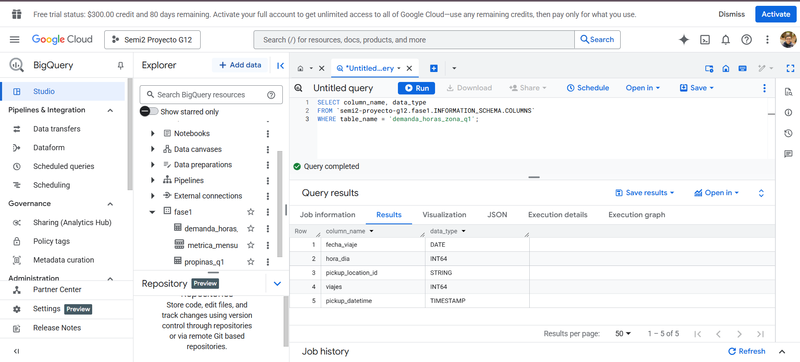
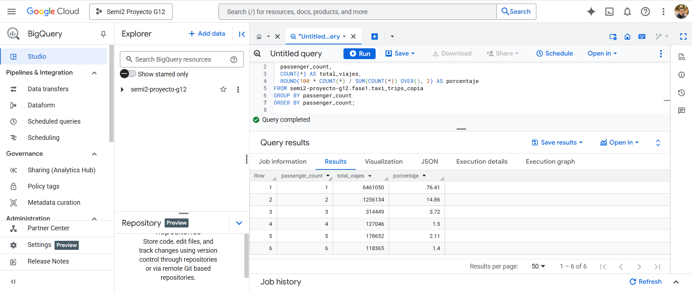

# 📊 Proyecto Fase 1 – Análisis Exploratorio de Datos Masivos en BigQuery
**Curso:** Seminario de Sistemas 2  
**Universidad:** USAC – Facultad de Ingeniería  
**Grupo:** G12  
**Integrantes:** [Nombres del equipo]

---

## 📌 Introducción
Este proyecto analiza los viajes en taxi de Nueva York durante el año 2022 usando el dataset público de BigQuery:  
`bigquery-public-data.new_york_taxi_trips.tlc_yellow_trips_2022`.

Se aplicaron técnicas de validación, limpieza, creación de tablas optimizadas, consultas SQL y visualización de resultados en Google Data Studio / Looker Studio.

---

## 🔎 Validaciones del dataset

📷 **Comprobación dataset público**  

📷 **Validación de columnas y nulos en dataset público**  

📷 **Consulta validación de nulos en dataset trabajado**  

📷 **Resultado validación de nulos en dataset trabajado**  

---

## 🛠️ Creación de tablas

📷 **Creación tabla base (taxi_trips_copia)**  

📷 **Información de tabla creada**  

📷 **Creación tabla de métricas mensuales**  

📷 **Creación tabla de propinas**  

📷 **Creación tabla demanda por hora y zona**  

📷 **Exploración de columnas – Parte 1**  

📷 **Exploración de columnas – Parte 2**  

---

## ✅ Validación de tablas

📷 **Validación de tabla base**  

📷 **Resultado validación tabla base (bytes y estructura)**  

📷 **Validación de tabla demanda**  

📷 **Validación de tabla propinas**  

---

## 📈 Consultas y métricas

📷 **Consulta total de viajes Q1 (enero–marzo)**  

📷 **Consulta viajes en febrero**  

📷 **Consulta viajes en efectivo en febrero**  

📷 **Consulta viajes desde zona específica (ejemplo zona 237)**  

📷 **Consulta distribución de pasajeros**  

📷 **Consulta relación distancia – tarifa – propina**  

📷 **Consulta duracion promedio de los viajes**

📷 **Consulta distribucion cantidad de pasajeros por viajes**

📷 **Consulta viajes por dia de la semana**

📷 **Consulta Reduccion de bytes**

📷 **Consulta Numero de viajes por cantidad de pasajeros**

📷 **Consulta relacion distancia-tarifa-propina**

---

## 📊 Visualizaciones / Dashboard

📷 **Visualización viajes por mes**  

📷 **Visualización viajes por hora del día**  

📷 **Visualización viajes por método de pago**  

📷 **Visualización viajes por propinas**  

📷 **Visualización top 10 zonas**  

👉 **[Enlace al Dashboard](imagenes/URL_DEL_DASHBOARD)**

---

## ⚡ Optimización y bytes procesados

Se compararon consultas en el dataset original y en la tabla optimizada (`taxi_trips_copia`) con **particiones y clustering**, mostrando la reducción en bytes procesados.

📷 **Evidencia reducción de bytes procesados**  

---

## 📜 Conclusiones
- Se comprobó la importancia de usar **particiones y clustering** para reducir costos y tiempos de consulta.  
- Se identificaron **patrones temporales** (por mes, hora, día de la semana).  
- Se analizaron **patrones categóricos** (métodos de pago, propinas, número de pasajeros).  
- Se generaron métricas clave: distancia promedio, duración, montos y propinas.  
- Se construyó un dashboard interactivo que facilita la interpretación visual.  

---
