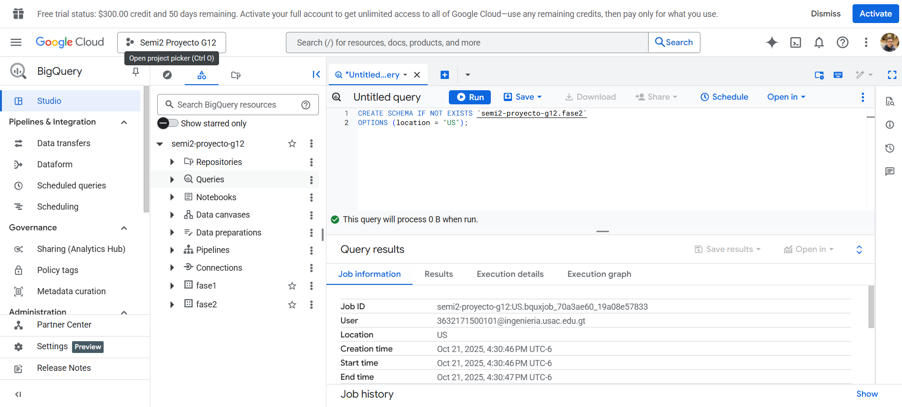
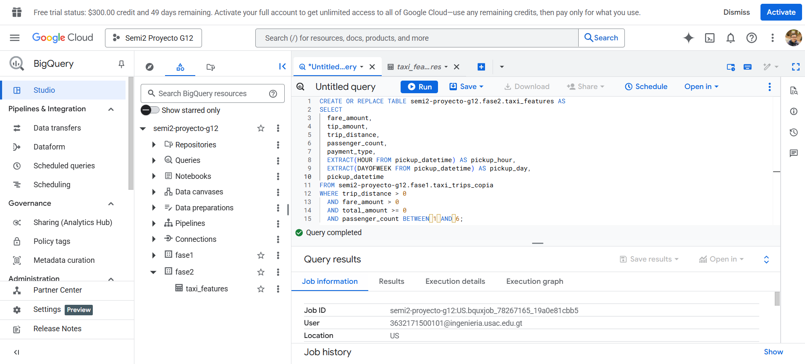
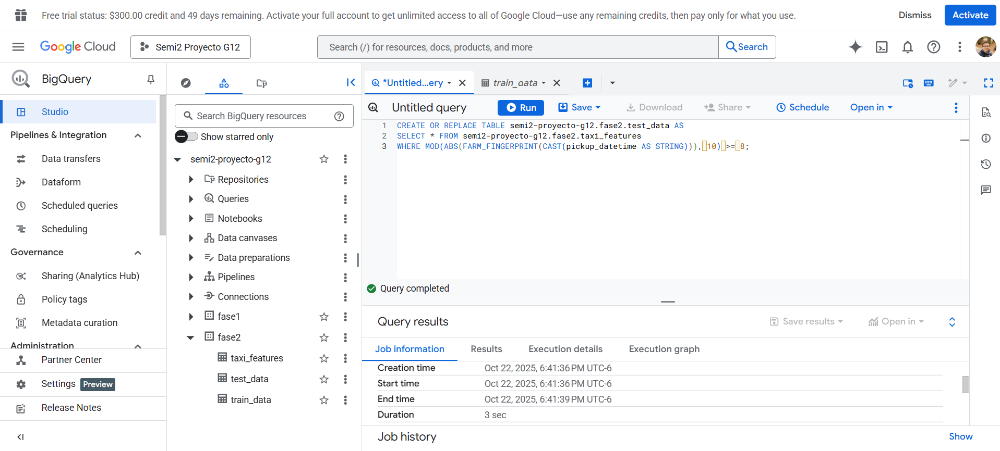
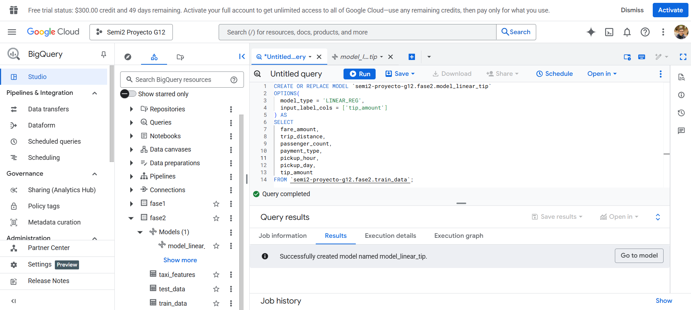
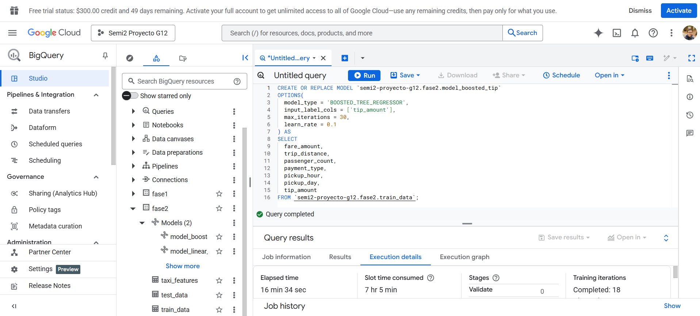
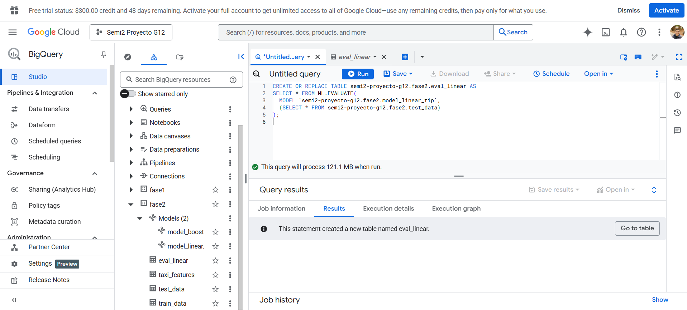
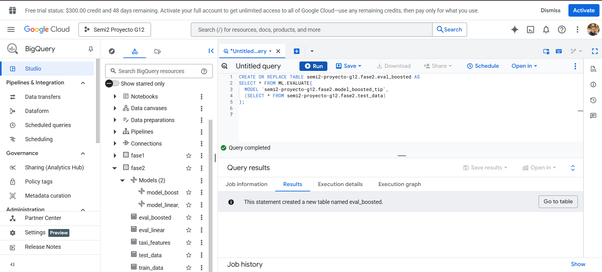
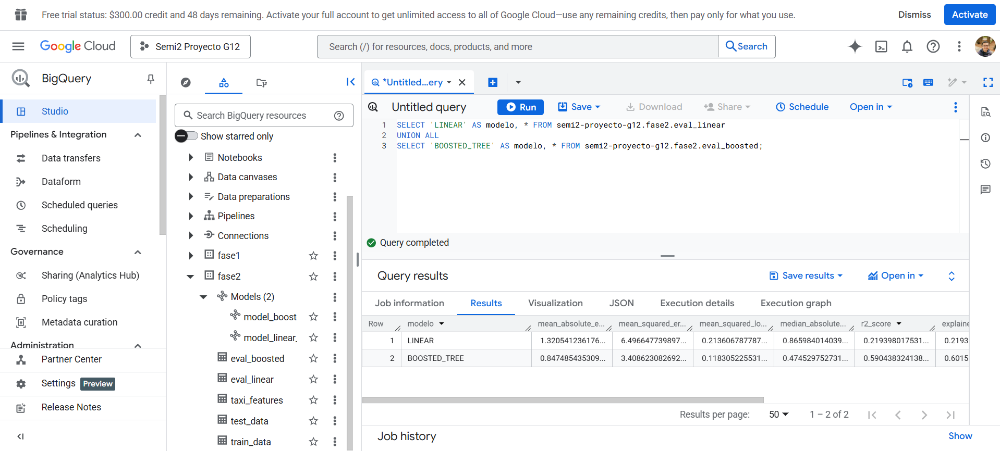
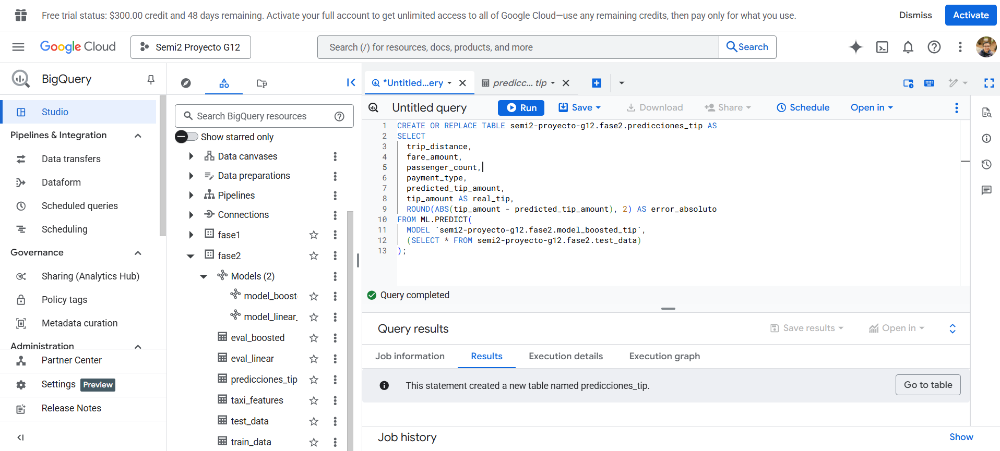

# Proyecto Fase 2 – Modelado Predictivo con BigQuery ML

**Curso:** Seminario de Sistemas 2  
**Universidad:** USAC – Facultad de Ingeniería  
**Grupo:** G12  
**Integrantes:**

- Juan Sebastian Higueros de Leon 201807344
- María Isabel Masaya Córdova 201800565

## Definición del problema

Se busca predecir el monto de propina (tip_amount) que un pasajero dejará en un viaje de taxi en Nueva York, utilizando datos históricos del primer trimestre de 2022.

**Tipo de problema:**

- Regresión (variable continua)

**Variable objetivo:**

- tip_amount

**Métricas principales:**

- RMSE (Root Mean Squared Error)

- MAE (Mean Absolute Error)

- R² (Coeficiente de determinación)

El objetivo es comparar el desempeño entre un modelo Lineal y un Árbol Potenciado entrenados directamente en BigQuery ML.

---

## Creacion del dataset para la fase 2

Para una mayor claridad en los datos que se generaron en esta fase se opto por crear un dataset separado en el cual se almacenaran todos los datos y modelos



## Preparación de datos (Ingeniería de Features)

A partir de la tabla limpia `fase1.taxi_trips_copia`, se crean variables relevantes para el modelado:

```sql

    CREATE OR REPLACE TABLE semi2-proyecto-g12.fase2.taxi_features AS
    SELECT
    fare_amount,
    tip_amount,
    trip_distance,
    passenger_count,
    payment_type,
    EXTRACT(HOUR FROM pickup_datetime) AS pickup_hour,
    EXTRACT(DAYOFWEEK FROM pickup_datetime) AS pickup_day,
    pickup_datetime
    FROM semi2-proyecto-g12.fase1.taxi_trips_copia
    WHERE trip_distance > 0
    AND fare_amount > 0
    AND total_amount >= 0
    AND passenger_count BETWEEN 1 AND 6;

```

se agregon las variables pickup_hour y pickup_day

pickup_hour debido a que los patrones de propina varían según hora del día:

- Horas nocturnas/madrugada: propinas más generosas
- Hora pico laboral: propinas estándar
- Mediodía: comportamiento intermedio

y pickup_day debido a que el comportamiento de propinas puede variar:

- Fines de semana: posiblemente más generosos (entretenimiento, alcohol)
- Días laborales: propinas más estándar (viajes al trabajo)



**Nuevas variables creadas:**

- `pickup_hour`: hora de inicio del viaje

- `pickup_day`: día de la semana (1=Domingo)

---

## División de datos (Train/Test)

Se dividen los datos en conjuntos de entrenamiento (80%) y prueba (20%) de manera aleatoria:

```sql
    CREATE OR REPLACE TABLE semi2-proyecto-g12.fase2.train_data AS
    SELECT * FROM semi2-proyecto-g12.fase2.taxi_features
    WHERE MOD(ABS(FARM_FINGERPRINT(CAST(pickup_datetime AS STRING))), 10) < 8;

    CREATE OR REPLACE TABLE semi2-proyecto-g12.fase2.test_data AS
    SELECT * FROM semi2-proyecto-g12.fase2.taxi_features
    WHERE MOD(ABS(FARM_FINGERPRINT(CAST(pickup_datetime AS STRING))), 10) >= 8;
```

**Motivo:** garantizar una evaluación imparcial del rendimiento del modelo.


Evidencia de la creacion de la tabla con datos de entrenamiento



Evidencia de la creacion de la tabla con los datos de prueba para los modelos

---

## Entrenamiento de Modelos

### Modelo 1 — Regresión Lineal

```sql
    CREATE OR REPLACE MODEL semi2-proyecto-g12.fase2.model_linear_tip
    OPTIONS(
    model_type = 'LINEAR_REG',
    input_label_cols = ['tip_amount']
    ) AS
    SELECT
    fare_amount,
    trip_distance,
    passenger_count,
    payment_type,
    pickup_hour,
    pickup_day,
    tip_amount
    FROM semi2-proyecto-g12.fase2.train_data;
```



Se opto por crear un modelo lineal por las siguientes razones

1. Establece un punto de comparación fundamental. Si modelos más complejos no superan significativamente a la regresión lineal, sugiere que la relación entre variables es predominantemente lineal.

2. Permite identificar claramente el peso de cada variable independiente sobre el monto de propina mediante coeficientes directos.

3. Requiere menos recursos de procesamiento y tiempo de entrenamiento, siendo ideal para implementaciones en tiempo real o con recursos limitados.

4. Ayuda a detectar relaciones lineales básicas entre variables como `fare_amount`, `trip_distance` y `tip_amount` antes de explorar modelos más complejos.

### Modelo 2 — Árbol Potenciado (Boosted Tree)

```sql
    CREATE OR REPLACE MODEL semi2-proyecto-g12.fase2.model_boosted_tip
    OPTIONS(
    model_type = 'BOOSTED_TREE_REGRESSOR',
    input_label_cols = ['tip_amount'],
    max_iterations = 30,
    learn_rate = 0.1
    ) AS
    SELECT
    fare_amount,
    trip_distance,
    passenger_count,
    payment_type,
    pickup_hour,
    pickup_day,
    tip_amount
    FROM semi2-proyecto-g12.fase2.train_data;
```



El segundo modelo por el que se opto en crear es un modelo boosted tree y se debe a las siguientes razones

1. Los árboles de decisión potenciados pueden identificar patrones complejos y no lineales que la regresión lineal no detecta, como interacciones entre hora del día y tipo de pago.

2. No requiere ingeniería manual de features para capturar interacciones entre variables (ej: `fare_amount × pickup_hour`). El modelo aprende estas relaciones automáticamente.

3. Los árboles son menos sensibles a valores atípicos en comparación con la regresión lineal, que puede verse afectada por observaciones extremas.

4. Para problemas de regresión con múltiples variables y relaciones complejas, los boosted trees típicamente superan a modelos lineales en métricas como RMSE y MAE.

---

## Evaluación de los Modelos

Se evalúan ambos modelos usando `ML.EVALUATE` sobre los datos de prueba:

```sql
    -- Evaluación del modelo lineal
    CREATE OR REPLACE TABLE semi2-proyecto-g12.fase2.eval_linear AS
    SELECT * FROM ML.EVALUATE(
    MODEL semi2-proyecto-g12.fase2.model_linear_tip,
    (SELECT * FROM semi2-proyecto-g12.fase2.test_data)
    );

    -- Evaluación del modelo Boosted Tree
    CREATE OR REPLACE TABLE semi2-proyecto-g12.fase2.eval_boosted AS
    SELECT * FROM ML.EVALUATE(
    MODEL semi2-proyecto-g12.fase2.model_boosted_tip,
    (SELECT * FROM semi2-proyecto-g12.fase2.test_data)
    );

    -- Comparación de resultados
    SELECT 'LINEAR' AS modelo, * FROM semi2-proyecto-g12.fase2.eval_linear
    UNION ALL
    SELECT 'BOOSTED_TREE' AS modelo, * FROM semi2-proyecto-g12.fase2.eval_boosted;
```

A continuacion se adjuntan las evidencias de la evaluaciones de ambos modelos

### modelo lineal



### modelo boosted tree



Luego de realizar las evaluaciones para cada uno de los modelos se realizo una comparacion para visualizar que modelo obtenia mejores resultado a continuacion se muestra la evidencia



Con los resultados anterioremente mostrados se puede concluir que el mejor modelo para la realizacion de las predicciones es el modelo boosted tree por lo cual se utilizara como base para el dashboard en looker studio.

---

## Generación de Predicciones

Con el mejor modelo (Boosted Tree), se generan predicciones sobre el conjunto de prueba:

```sql
    CREATE OR REPLACE TABLE semi2-proyecto-g12.fase2.predicciones_tip AS
    SELECT
    trip_distance,
    fare_amount,
    passenger_count,
    payment_type,
    predicted_tip_amount,
    tip_amount AS real_tip,
    ROUND(ABS(tip_amount - predicted_tip_amount), 2) AS error_absoluto
    FROM ML.PREDICT(
    MODEL semi2-proyecto-g12.fase2.model_boosted_tip,
    (SELECT * FROM semi2-proyecto-g12.fase2.test_data)
);
```

Esta tabla se conectara a looker studio para la creacion del dashboard

A continuacion se muestra la evidencia de la creacion de esta tabla



---

## Visualización de Resultados (Dashboard)

**Herramienta recomendada:** Looker Studio

Conectar la tabla `fase2.predicciones_tip` y la tabla `fase2.taxi_features` para crear los siguientes graficos:

- **Gráfico 1:** Grafico de pie de los datos predichos
- **Gráfico 2:** Grafico de pie con los datos reales
- **Grafico 3:** Grafico de barra apiladas con el que se comparan fare_amount y payment_type de las tabla predichas y reales
- **Grafico 4:** Grafico de indicadores en los que se visualizan los datos de fare_amount de los datos predichos

**[Enlace al dashboard](https://lookerstudio.google.com/reporting/556d03b1-9e94-4d06-8e0f-ade110b9c22a)**

---

## Conclusiones

- El modelo Boosted Tree logró menor RMSE y mejor ajuste que el lineal
- La hora del día y el monto de la tarifa influyen fuertemente en el monto de propina
- La regresión lineal resultó más interpretable, pero con menor capacidad predictiva
- Se evidenció la importancia de features temporales para capturar patrones de comportamiento
